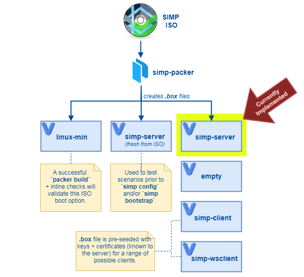

[![License][license-badge]][license-url]
[![Build Status][travis-badge]][travis-project]
[![SIMP compatibility][simp-badge]][simp-badge]

# simp-packer

[Packer][packer]-based tooling to build [Beaker][beaker]-ready
[Vagrant][vagrant] boxes from [SIMP ISO files][simp-iso-downloads].


<!-- vim-markdown-toc GFM -->

* [Overview](#overview)
* [Setup](#setup)
* [Usage](#usage)
  * [Using the `simp_packer_test.sh` script](#using-the-simp_packer_testsh-script)
    * [Manually creating the configuration files](#manually-creating-the-configuration-files)
    * [Output file locations](#output-file-locations)
  * [Running a build matrix](#running-a-build-matrix)
    * [Matrix elements](#matrix-elements)
    * [Environment variables for build matrices](#environment-variables-for-build-matrices)
  * [Environment variables](#environment-variables)
* [Reference](#reference)
  * [Project structure](#project-structure)
  * [Supported SIMP releases](#supported-simp-releases)
  * [The Packer file](#the-packer-file)
    * [Build Section](#build-section)
    * [Provisioning Section](#provisioning-section)
      * [The `simpsetup::` module](#the-simpsetup-module)
  * [The Vagrantfile](#the-vagrantfile)
  * [Default SIMP server environment](#default-simp-server-environment)
  * [Troubleshooting & common problems](#troubleshooting--common-problems)
    * [Building the boxes](#building-the-boxes)
      * [`fatal error: runtime: out of memory`](#fatal-error-runtime-out-of-memory)
      * [`Post-processor failed:` ... `no space left on device`](#post-processor-failed--no-space-left-on-device)
* [Development](#development)
  * [Contributing to `simp-packer`](#contributing-to-simp-packer)
  * [Travis pipeline](#travis-pipeline)
* [TODO](#todo)
  * [Documentation](#documentation)
  * [Tests](#tests)
  * [Box roles](#box-roles)
  * [Features](#features)
  * [Cleanup](#cleanup)

<!-- vim-markdown-toc -->

## Overview

![simp-packer basics][simp-packer-basics]

* `simp-packer` supports SIMP >= 6.0.0-0.
* The Vagrant boxes use the Virtualbox hypervisor, and are built using the Vagrant's [virtualbox-iso][vagrant-virtualbox-iso] builder.
* See the [roadmap](#roadmap)

[simp-packer-basics]: assets/simp-packer-basics.png

## Setup

Requirements:

* [VirtualBox](https://www.virtualbox.org/wiki/Downloads)
* [Vagrant](https://www.vagrantup.com/downloads.html)
* [Packer](https://www.packer.io/downloads.html) (distributed as a binary).

  - Ensure the binary is in your `$PATH` and comes before any other packer
    executables on the system (e.g., `export PATH="/path/to/packer:$PATH"`).
  - `simp-packer` 2.* requires `packer` version 1.2.4 or later. This update is
    to support UEFI boot of SIMP servers. Since VirtualBox does not support
    UEFI tftpboot, the SIMP clients will use legacy BIOS boot.

* A [SIMP][SIMP] ISO (`.iso`) file. Either an official release or one generated
  by [simp-core](https://github.com/simp/simp-core) build commands.
  * _(Optional, but useful:)_ The `.json` "vars" file that was generated along
    with the SIMP `.iso` file. This file is generated by the SIMP ISO build
    process.


## Usage

There are two ways to run simp-packer:

1. [Using the `simp_packer_test.sh` script](#using-the-simp_packer_testsh-script)

   - Creates _unversioned_ Vagrant boxes
   - Requires [manually creating the configuration files](#manually-creating-the-configuration-files)

2. [Running a build matrix](#running-a-build-matrix)

   - Creates and publishes 1–n Vagrant boxes, based on a matrix of configurations
   - Configured by environment variables and rake task arguments
   - Publishes Vagrant boxes to a local directory tree along with JSON files
     to describe **_versioned_** metadata about each box.
     - Beaker and `vagrant init` can use this JSON metadata to request, compare,
       and upgrade Vagrant boxes.

### Using the `simp_packer_test.sh` script

The most basic was to use simp-packer is by running the `simp_packer_test.sh`
script:

```sh
TMPDIR=/some/tmp/dir ./simp_packer_test.sh /path/to/test/directory
```

- `simp_packer_test.sh` creates a Vagrant box _without version metadata_.  The
  script must be run from the top level of the `simp-packer` directory,
- `packer` uses around twice the space of the virtual image footprint when
  building, so ensure that `TMPDIR` has sufficient space.  `TMPDIR` defaults to
  `/tmp` which is not (usually) large enough.

#### Manually creating the configuration files

Create a **test directory**, and include the following files:

* `vars.json`:  The JSON file corresponding with the SIMP ISO.  Contains
  variables that point to the ISO, the ISO checksum, the name of the
  distribution ISO, and the `root` password. Samples can be found in
  `samples/<sample>/vars.json`.
* `simp_conf.yaml`:  YAML generated by `simp config`.  You can use a copy of
  one from a previous build or edit one from from
  `samples/<sample>/simp_conf.yaml`. Puppet server and FIPS configurations will
  be overridden by `simp_config.rb` and `packer.yaml`.
* `packer.yaml`:  Overrides defaults set in `simp_config.rb`.  Packer requires
  this file (even if you don't want to override defaults). Samples can be found
  in `samples/<sample>/packer.yaml`.  For CentOS 6 builds, you **MUST** change
  the `nat_interface` and `host_only_interface` to `eth0` and `eth1`,
  respectively.

See [samples/README.md](samples/README.md) for more information.

#### Output file locations

- A **working directory** will be created under the test directory, where all the
  scripts, manifests, and files are kept. It is erased on completion of the
  test, but can be preserved with `SIMP_PACKER_save_WORKINGDIR=true`.
- A time-stamped **log file** is created in the top level of the test directory and
  all the log output from `packer` is copied there. If the `packer` build
  fails, it is renamed from `<date>.log` to `<date>.log.errors`.
- A **Vagrant box file** (`*.box`) with its `Vagrantfile` and `Vagrantfile.erb`
  will be located in the directory defined by the `packer.yaml file`
  `output_directory` (default is `<testdirectory>/OUTPUT`).


### Running a build matrix

Often, it is desirable to build several 'flavors' of simp-packer boxes at the
same time. A rake task, `simp:packer:matrix` has been provided for this purpose:

```sh
[ENV_VAR=value ...] bundle exec rake simp:packer:matrix[MATRIX_ELEMENTS ...]
```

A typical example would look like:

```sh
TMPDIR="$PWD/tmp" \
MATRIX_LABEL=build_6.2.0RC1_ \
VAGRANT_BOX_DIR="$PATH_TO_VAGRANT_BOX_TREE" \
SIMP_ISO_JSON_FILES='${PATH_TO_ISO_JSON_FILES}/SIMP-6.2.0-0.el*.json' \
bundle exec rake simp:packer:matrix[os=el6:el7,fips=on:off]
```

Assuming the glob `${PATH_TO_ISO_JSON_FILES}/SIMP-6.2.0-0.el*.json` matched two
files (one for `el6` and one for `el7`), this would result in four back-to-back
simp-packer builds:

* (`os=el6`, `fips=on`)  SIMP-6.2.0-0.el6 with FIPS mode enabled
* (`os=el7`, `fips=on`)   SIMP-6.2.0-0.el7 with FIPS mode enabled
* (`os=el6`, `fips=off`) SIMP-6.2.0-0.el6 with FIPS mode disabled
* (`os=el7`, `fips=off`) SIMP-6.2.0-0.el7 with FIPS mode disabled

#### Matrix elements

Matrix elements are delimited by colons (`:`)

| Matrix args   | Supported | Default |  Description |
| ------------- | :-------: | :-----: | ------------ |
| `os=`         | `el6:el7` | `el6:el7` | OSes to include in the matrix.  JSON files will be filtered out if their data doesn't match one of these OS. |
| `fips=`       | `on:off` | `on` |  Build SIMP Vagrant box with FIPS mode enabled |
| `encryption=` | `on:off` | `off`| _(experimental)_ Build SIMP Vagrant box with disk encryption |
| `json=`       | _filepaths_ | N/A | _(optional, if `SIMP_ISO_JSON_FILES` is set)_ List of absolute paths/globs to SIMP ISO `.json` files to consider |


**NOTE:** `.json` files (specified by `json=` and/or the environment variable
`SIMP_ISO_JSON_FILES`) are _filtered_ based on whether their data matches the
`os=` matrix argument.

* If `os=el6` and the glob `${PATH_TO_ISO_JSON_FILES}/SIMP-6.2.0-0.el*.json`
  matched two files (one with data for `el6` and one for `el7`), only the file
  with data for `el6` would be included in the matrix (and the `el7` file would
  not be used).
* If `os=el6:el7` and the glob
  `${PATH_TO_ISO_JSON_FILES}/SIMP-6.2.0-0.el*.json` matched two files (one with
  data for `el6` and one for `el7`), only the file with data for `el6` would be
  included in the matrix—and the `el7` file would not be used.


#### Environment variables for build matrices

| Environment variable  | Description                     |
| --------------------- | ------------------------------- |
| `VAGRANT_BOX_DIR`     | Path to top of Vagrant box tree |
| `SIMP_ISO_JSON_FILES` | List of absolute paths/globs to SIMP ISO `.json` files to consider (delimiters: `:`, `,`).  This variable can be used as an alternative to the matrix entry `json=`.  Non-existent paths will be discarded with a warning message |
| `MATRIX_LABEL`        | Label for this matrix run that will prefix each iteration's directory name (default: `build`) |

### Environment variables

* The [Environment Variables for Packer][packer-env-vars] are useful to customize builds.
* Other important variables:

| Variable                     | Description |
| ---------------------------- | ----------- |
| [**`TMPDIR`**][TMPDIR]       | This is a POSIX environment variable that is often **critical to set** when running packer: the directory _must_ be able to store over 4GB as the box is being built.  The default location is `/tmp`, which on many systems is unable to store that much data. |
| **`EXTRA_SIMP_PACKER_ARGS`** | Extra CLI arguments when running `packer build` |
| **`SIMP_PACKER_verbose`**    |  When `yes`, some simp-packer logic produces more detailed output (default: `no`).|


## Reference

### Project structure

```
./
├── assets/ ................ Images used by README.md
├── lib/                     Ruby libraries
├── puppet/                  ‡Puppet code (run inside VM)
│   └── modules/                ‡ contains `simpsetup::`
├── rakelib/ ............... Rake tasks
├── samples/
│   └── README.md
├── scripts/................ ‡ Shell scripts (run inside VM)
│   ├── config/                 ‡ scripts that configure the VM
│   ├── tests/                  ‡ VM tests
├── templates/.............. Templates
│   ├── simp.json.template      Annotated JSON Packer template
│   ├── Vagrantfile.erb         Vagrantfile generated along with `.box` files
│   └── Vagrantfile.erb.erb     Vagrantfile.erb (for `vagrant init --template`)
├── README.md
├── simp_config.rb*
└── simp_packer_test.sh* ... Main shell script
```

‡ = Executed inside VMs as simp-packer is building them


### Supported SIMP releases

In order to supportintegration-tested upgrades, simp-packer maintains support
for older releases of SIMP.  The following release versions are currently
supported:

| SIMP ISO               | CentOS 7 | CentOS 6 |  Notes        |
| ---------------------- | -------- | -------- |  ------------ |
| 6.1.0-0                | ✔️        | ✔️        |
| _6.2.0-RC1_            | ✔️        | ✔️        |
| 6.2.0-0                | ✔️        | ✔️        | Final Puppet 4.x release |
| _6.3.0_ _(dev builds)_ | ✔️        | :x:      |


### The Packer file

The packer file is generated from the file `templates/simp.json.template`.

#### Build Section

- Installs the ISO
- Adds the `vagrant` user
- Sets `root`'s umask
- Configures the network to start up a boot time
- Changes the passwords for `simp` and `root`
- Updates the `sudoers` file so `simp` user can sudo without a password and
  without a tty

#### Provisioning Section

Runs a suite of configurations and tests while packer is provisioning the new
box:

Configurations:

- Checks that FIPS was enabled/disabled per configuration.
- Runs `simp config` and `simp bootstrap`.
- Installs a manifest that configures the `vagrant` user so you can `vagrant
  ssh` once the box is built, configures `simp` user so `packer` can continue
  working
- Reboots and runs Puppet a couple of times.

Tests:

- Ensures that the build of the puppetserver is successful and the puppetserver
  is up and running and listening on the ports configured in `simp_conf.yaml`.
- Verifies that FIPS is setting match across the `simp_conf.yaml`, the
  `simp_config_settings.yaml` and the operational environment.
- Checks that selinux is set to `enforcing` (the default for simp.)
- If `simp_crypt_disk` is used in the `simp.conf`, it verifies that the disk is
  encrypted.
- Verifies that `/`, `/var/`,`/var/audit` are separate partitions.
- Checks that the port in `puppet.conf` file matches the port in
  `simp_conf.yaml`


##### The `simpsetup::` module

If the tests pass, it will configure the Puppet server.  The `simpsetup`
module is applied using `puppet apply`.  It is run once so that if you make
changes later on they are not overwritten. This module does the following:

- Sets up the kickstart files
- Sets up DNS
- Sets up TFTP manifests
- Runs the FakeCA `togen` script to generate SIMP application certificates for
  the SIMP server and all the clients pre-configured in DHCP and DNS.
- Adds users and groups into LDAP
- Sets up autosign to be `*.<domain name>`, so kickstarted systems will get
  their Puppet certificates autosigned.
- Runs scripts that edit the `site.pp` file to create some hostgroups and the
  SIMP server's hiera file to include kickstart and tftpboot classes.
- Copies into the `site` module, but does not use, other useful manifests site
  such as `workstation.pp` and `nfs.pp`.  These manifests will be refined as
  the test suite is expanded.
- Runs puppet once more

The post-processor then exports the VirtualBox to a Vagrant box and removes the
output directory.


### The Vagrantfile

- The `vagrant` user's SSH password is `vagrant`.
- The Vagrantfile is not wrapped in the Vagrant `.box`, so the network
  settings can be seen. Vagrant is not easily configured to check if a vbox
  hostonly network exists; you will have to ensure the network exists before
  running `vagrant up`.
- You can change the network name in the Vagrant file.
- The Vagrantfile does not configure the machine to _use_ its IP address.
  You can turn it on, but changing the IP address will mess up the puppet
  server.
- [Synced folders][vagrant-synced-folders] are disabled.


### Default SIMP server environment

- The Puppet server's IP will be `X.X.X.7`
- DHCP and DNS are pre-populated with entries for `server21.domain.name`
  through `server29.domain.name`, and `ws31.domain.name` to `ws39.domain.name`.
  - Each host's IP and MAC will match the hostname's number: e.g., `server21`
    will have the IP `X.X.X.21` and the MAC address `XX:XX:XX:XX:XX:21`.
- The default password for the `root` and `simp` user accounts is
  `P@ssw0rdP@ssw0rd`.
  - You can override this in `vars.json` by setting `new_password`.
  - At this time, there is no mechanism to change the LDAP Password.
- The SIMP server is configured to be an LDAP server:
  - The `basedn` will match the `packer.yaml`'s `domain` (or use the default).
  - Basic LDAP users are included: `user1`, `user2`, `admin1`, `admin2`
    - `admin1` and `admin2` are in the `administrators` group.
- The default distribution's ISO path is `/net/ISO/Distribution_ISOs`. This is
  currently hard-coded in `simp.json.template`.

### Troubleshooting & common problems

#### Building the boxes

##### `fatal error: runtime: out of memory`

This error is generally encountered during the OS ISO upload, and it means what it
says: the host machine that is building the VM has run out of available RAM

**Characteristic log snippet:**

```
2018/08/13 15:38:35 ui: ==> virtualbox-iso: Uploading /path/to/ISO/CentOS-7-x86_64-DVD-1708.iso => /var/local/simp/CentOS-7-x86
_64-DVD-1708.iso
==> virtualbox-iso: Uploading /path/to/ISO/CentOS-7-x86_64-DVD-1708.iso => /var/local/simp/CentOS-7-x86_64-DVD-1708.iso
2018/08/13 15:38:35 packer: 2018/08/13 15:38:35 [DEBUG] Opening new ssh session
2018/08/13 15:38:35 packer: 2018/08/13 15:38:35 [DEBUG] Starting remote scp process:  scp -vt /var/local/simp
2018/08/13 15:38:35 packer: 2018/08/13 15:38:35 [DEBUG] Started SCP session, beginning transfers...
2018/08/13 15:38:35 packer: 2018/08/13 15:38:35 [DEBUG] scp: Uploading CentOS-7-x86_64-DVD-1708.iso: perms=C0600 size=4521459712
2018/08/13 15:38:43 packer: fatal error: runtime: out of memory
2018/08/13 15:38:43 packer:
2018/08/13 15:38:43 packer: runtime stack:
2018/08/13 15:38:43 packer: runtime.throw(0x2314ecc, 0x16)
2018/08/13 15:38:43 packer:     /usr/local/go/src/runtime/panic.go:616 +0x81
```


##### `Post-processor failed:` ... `no space left on device`

`simp_config.rb` configures the vagrant post-processor to write the `.box` file
into the `<testingdirectory>/OUTPUT` directory, or the path of
`output_directory` if it is defined by the `packer.yaml` file.  If this
location does not have the capacity to hold the box while it is being
constructed, it will fail.

**Characteristic log snippet:**

```
==> virtualbox-iso: Running post-processor: vagrant
==> virtualbox-iso (vagrant): Creating Vagrant box for 'virtualbox' provider
    virtualbox-iso (vagrant): Copying from artifact: OUTPUT/packer-virtualbox-iso-1454117110-disk1.vmdk
Build 'virtualbox-iso' errored: 1 error(s) occurred:

* Post-processor failed: write /tmp/packer040362584/packer-virtualbox-iso-1454117110-disk1.vmdk: no space left on device

==> Some builds didn't complete successfully and had errors:
--> virtualbox-iso: 1 error(s) occurred:

* Post-processor failed: write /tmp/packer040362584/packer-virtualbox-iso-1454117110-disk1.vmdk: no space left on device

==> Builds finished but no artifacts were created.
```


## Development

### Contributing to `simp-packer`

Please read our [Contribution Guide][simp-contrib].

If you find any issues, they can be submitted to our [JIRA][simp-jira].

To see a list of development-related tasks available for this project, run:

      bundle exec rake -T

### Travis pipeline

**Validation:**

* Ruby code is linted with [rubocop][rubocop], using `bundle exec rake
  test:rubocup`.
* Shell scripts are linted with [shellcheck][shellcheck], using `bundle exec
  test:shellcheck`.
  * _(The `shellcheck` binary is is now built into Travis CI environments, even
    for `language: ruby`!)_
  * **NOTE:** The version of `shellcheck` on Travis CI may be different than
    your local development environment.  In particular, the EL7 EPEL `ShellCheck`
    package is much older (0.35 vs 0.45+)—in practice, this has generally
    meant that `shellcheck` in Travis CI catches more nuanced errors.
* Puppet code and metadata is linted as part of the
  `test:puppet` rake task.  At the moment, only Puppet code  under
  `puppet/modules/` is linted.

**Puppet (SIMP versions):**

* All Puppet modules under the `puppet/modules/` directory will be tested
  using `bundle exec rake test:puppet`.
* The Travis CI pipeline matrix only considers the versions of Puppet used in
  SIMP along with the latest 5.x (which is informational, and allowed to fail).


## TODO

### Documentation

- [x] Verify documentation
- [x] Environment Variables
- [ ] What does `simp_config.rb` do?
- [ ] The purpose of simp-packer
- [x] Contribution/Development
- [ ] Roadmap

### Tests

- [x] Asset tests _(phase 1—low-hanging fruit)_:
  - [x] [Shellcheck][shellcheck] to lint shell scripts
  - [x] [Rubocop][rubocop] to lint ruby scripts
  - [x] Local Puppet module tests: syntax validation, lint checks, and spec
  - [x] All asset tests should be run from rake tasks
  - [x] Update the Travis CI pipeline to run asset tests
- [ ] Asset tests _(phase 2—more complete)_:
  - [ ] Tests (at least linting) for any non-module puppet manifests?
  - [ ] Validate `simp.json.template` creates a parseable JSON file
  - [ ] Validate `simp.json` using the [packer JSON _schema_][packer-schema]
  - [ ] Spec tests for ruby code (after refactoring into testable components)
        under `lib/`)
  - [ ] Update the GitLab CI pipeline to run asset tests
    - `test:shellcheck` will need a `shellcheck`-capable CI Runner
- [ ] Integration tests during `packer build`:
  - [ ] Test if the SIMP server's YUM repos are setup and working. These are
    the repos the SIMP clients are configured to use.
  - [ ] Check if puppet is actually running on the port you specified using
    `netstat` or `ss`.
  - [ ] Add one last puppet run in at the end and check that it returns 0.
    Since all services including DNS should be set up, nothing should change at
    that point.)

###  Box roles

After [SIMP-5238][SIMP-5238] is complete, simp-packer is intended to create a
family of different SIMP box configurations to support automated integration
tests for the entire SIMP Pre-Release checklist:



The following family of box roles can be used to automate integration tests for
an ISO-based SIMP release:

- [x] **`simp-server`** — a freshly-installed SIMP server, with `simp config` and `simp bootstrap` already applied
- [ ] **`simp-server-noconfig`** — a freshly-install `simp-server`, but _before_ running `simp config`
- [ ] **`empty`** — a completely [empty vagrant box][empty-vagrant-box], used to test PXE boots and kickstarts
- [ ] **`simp-client`** — a pre-seeded SIMP client
- [ ] **`simp-wsclient`** — a pre-seeded SIMP workstation client
- [ ] **`linux-min`** — a SIMP installation using the `linux-min` boot option

Non-ISO installations can be also be configured and tested, and they would be
able to re-use most of the Beaker suites designed for use with the
`simp-server` box role in [simp-integration_tests][simp-integration_tests].

- [ ] Alternative `simp-server` boxes:
  - [ ] **`yumbuilt-simp-server`** — a freshly-installed SIMP server, built
    from a fresh OS install using the [Installing SIMP From A
    Repository][simp-doc-install-from-repo] procedure.
  - [ ] **`r10kbuilt-simp-server`** — a freshly-installed SIMP server, built
    from a fresh OS install using the [r10k/Code Manager
    Installation][simp-doc-install-from-r10k] procedure.

### Features

- [ ] Compose `simp-packer.json` from JSON snippets ([SIMP-5238][SIMP-5238])
- [ ] Move the packer build into a rake task
- [ ] Support move to Hiera 5 when building SIMP 6.3+ boxes:
  - [ ] New system installs for SIMP >= 6.3+ use Hiera 5
  - [ ] New system installs for SIMP <= 6.2.x must still use Hiera 3
  - [ ] After upgrading SIMP <= 6.2.x to 6.3+, legacy Hiera 3 systems must still work
    - This is mostly a concern for `simp-integration_tests`
- [x] `simp:packer:matrix` matrix build
- [x] Refactor reusable host-side ruby code into a `lib/` directory
- [ ] Add an Environment variable in to allow it to create the box, even if tests
      fail.
- [ ] Kickstart a client to go with the box _(see: [Box roles](#box-roles))_
- [x] Make the location of the distribution ISO configurable.  ~~Right now it is
      hard-coded to be `/net/ISO/Distribution_ISOs`~~ _(Now provided by
      `vars.json` > `iso_url`)_
- [ ] Validate input from `packer.yaml`
- [ ] Don't fail if `packer.yaml` doesn't exist (it should be able to run with
      all the defaults).
- [x] Save version metadata for a `.box` file in Vagrant Cloud API format
     (`rake vagrant:json`)
- [ ] Scaffold and maintain a local Vagrant box directory tree of `.box` and
  `.json` version metadata files.  The `.json` files must be consumable by
  local `vagrant init` and `vagrant up` commands.
     - [x] ~~Scaffold tree~~ (`rake vagrant:publish:local`)
     - [x] ~~Add boxes to tree~~ (`rake vagrant:publish:local`)
     - [ ] Remove boxes from tree
     - [ ] List boxes in tree
     - [ ] Find/search boxes in tree
     - [ ] Refresh top-level box metadata to include all versions of each box
     - [ ] Prune older box versions from tree

### Cleanup

- [ ] Restructure project to place puppet code in one place, ruby another, etc
  - [x] ruby
    - [x] rake tasks
    - [ ] simp_config.rb
  - [ ] puppet
    - [x] modules
    - [ ] right now some Puppet code is embedded as bash heredocs
- [ ] Change the `packer.yaml` settings to match the names used in the
  `simp.json` file to make things more consistent and will allow code
  simplification.
- [ ] Merge the `simp_config.rb` and `simp_packer_tests.sh` into one ruby
  script and clean it up.
- [ ] Delete the Virtualbox host-only network if we created it
- [x] `rake clean` should delete symlinks that will break packer.
- [x] Fix builds from SIMP-6.1.0-0 ISOs


[simp]:                    https://github.com/NationalSecurityAgency/SIMP
[simp-contrib]:            https://simp.readthedocs.io/en/master/contributors_guide/
[simp-jira]:               https://simp-project.atlassian.net
[packer]:                  https://packer.io
[packer-schema]:           https://github.com/lostintangent/packer-schema
[vagrant]:                 https://www.vagrantup.com
[vagrant-virtualbox-iso]:  https://www.packer.io/docs/builders/virtualbox-iso.html
[vagrant-synced-folders]:  https://www.vagrantup.com/docs/synced-folders/
[packer-env-vars]:         https://www.packer.io/docs/other/environment-variables.html
[beaker]:                  https://github.com/puppetlabs/beaker
[rubocop]:                 https://github.com/rubocop-hq/rubocop
[shellcheck]:              https://github.com/koalaman/shellcheck
[simp-iso-downloads]:      https://download.simp-project.com/simp/ISO/
[simp-integration_tests]:  https://github.com/op-ct/simp-integration_tests
[empty-vagrant-box]:       https://github.com/op-ct/simp-pxe-vagrantfile/blob/master/empty_box/packer/packer__empty_box.json
[TMPDIR]:                  https://en.wikipedia.org/wiki/TMPDIR

<!-- SIMP issues and procedures -->
[SIMP-5238]:                  https://simp-project.atlassian.net/browse/SIMP-5238
[simp-doc-install-from-repo]: https://simp.readthedocs.io/en/latest/getting_started_guide/Installation_Options/Repository/Installing_SIMP_From_A_Repository.html
[simp-doc-install-from-r10k]: https://simp.readthedocs.io/en/latest/getting_started_guide/Installation_Options/r10k/index.html

<!-- badges and badge links -->
[license-badge]:  http://img.shields.io/:license-apache-blue.svg
[license-url]:    http://www.apache.org/licenses/LICENSE-2.0.html
[simp-badge]:     https://img.shields.io/badge/SIMP%20compatibility-6.*-orange.svg
[travis-badge]:   https://travis-ci.org/simp/simp-packer.svg?branch=master
[travis-project]: https://travis-ci.org/simp/simp-packer
